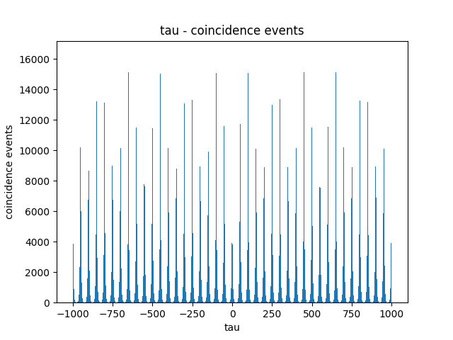

## Introduction
This is a program that runs a Monte Carlo simulation of the [Hanbury Brown & Twiss experiment](https://en.wikipedia.org/wiki/Hanbury_Brown_and_Twiss_effect).

## Prerequisites
- Have a [Python](https://www.python.org/downloads/) interpreter installed, code works on version 3.14.
- Have [uv](https://docs.astral.sh/uv/getting-started/installation/) installed.

## Usage
Clone the repository
```
git clone https://github.com/jundaemon/hbt.git
```

Create a virtual environment
```
uv venv
```

Then install dependencies (no need to activate the virtual environment, uv does that for you for any uv command)
```
uv sync --frozen
```

Run the program and you should get an excel sheet with generated values
```
uv run main.py
```

## Benchmarks

An average of 0.21s for:
1) Creation of 2, dynamically calculated, size 500_000 Numpy arrays
2) Concatenating and sorting 1_000_000 elements
3) 50-50 Numpy array split
4) Worst case of ~20_000_000 $\tau$ calculations
5) Histogram creation
6) Peak finding
7) Second order correlation calculation

## Core calculations walkthrough

### t_calc

```python
def t_calc(
    rng: np.random.Generator, exp_N: int, T_ns: float, eff: float, lifetime_ns: float
) -> np.ndarray:
    dur = np.log(rng.random(exp_N)) * -lifetime_ns
    if eff == 1.0:
        return (np.arange(0, exp_N) * T_ns) + dur
    else:
        return (
            np.cumsum(np.floor(np.log(rng.random(exp_N)) / np.log(1 - eff)) + 1) * T_ns
        ) + dur
```

This function calculates a series of timestamps when photons are detected at a detector, assuming emission to detection is instant. An emitter will emit `exp_N` (expected N) photons and the time at which they are detected is affected by `T_ns` (period of pulses), `eff` (efficiency of the medium) and `lifetime_ns` (lifetime of electrons).

Photons are not immediately emitted when the medium is pulsed with a laser. Instead, the time taken for photon emission is modelled by exponential distribution, $P(t) = e^{-\frac{t}{\tau}}$, where $\tau$ is the lifetime of an electron. Solving for $t$, $t = -\tau \cdot \ln(U)$, where $U$ is arbitrary in the range $[0, 1)$. The first line of this function thus calculates the time taken for photon emission after a laser pulse for all photons.

Photons are not necassarily guaranteed to be emitted after a laser pulse, this is instead determined by the efficiency of the medium. If the efficiency of the medium is 1 in the range $(0, 1]$, then photons are guaranteed to be emitted. Thus, add the emission duration to the period of the pulse multiplied with the index of the photon for all photons and return it. But if the efficiency of the medium is less than 1, then the emission of a photon is not guaranteed for each pulse. The naive way to handle this would be to loop until the set is full and for each iteration, compare a randomly generated number with the efficiency of the medium, if it is lower, add the timestamp to the set and continue. Such an approach would look like

```python
set_t = np.empty(exp_N)
i = 0
while i < exp_N:
    if rng.random() < eff:
        set_t[i] = i * T_ns
        i += 1
```

This is terribly slow, the program is iterating more than $n$ times for an $n$ sized array, not to mention the generation of a random number for each iteration. To combat this, a geometric distribution is used to determine the number of pulses needed for a successful photon emission, based on the efficiency of the medium. The number of pulses needed for a successful photon emission is modelled by $P(k) = 1 - (1 - eff)^k$. Solving for $k$, $k = \frac{\ln(1 - U)}{\ln(1 - eff)}$, where $U$ is arbitrary in range $[0, 1)$. `np.cumsum(np.floor(np.log(rng.random(exp_N)) / np.log(1 - eff)) + 1)` thus calculates the indexes where a pulse leads to a successful photon emission. The result is then multiplied with the period of pulse, the duration of emission is then added at the end.

### t_split

```python
set_t = np.sort(np.concat([set_t_1, set_t_2]))

def t_split(rng: np.random.Generator, set_t: np.ndarray) -> list[np.ndarray]:
    mask = rng.random(len(set_t)) <= 0.5
    return [set_t[mask], set_t[~mask]]
```

Once the expected number of photons for each emitter have been generated, the timestamps are combined and sorted. A mask is then applied on the result to simulate a 50-50 beam splitter, the result is the timestamps of photons arriving at either detector, index 0 being the array of arrival times at detector 1 and index 1 being the array of arrival times at detector 2.

### tau_calc

```python
def tau_calc(sets_t: list[np.ndarray], half_window_ns: float) -> np.ndarray:
    starts = np.searchsorted(sets_t[1], sets_t[0] - half_window_ns, side="left")
    ranges = (
        np.searchsorted(sets_t[1], sets_t[0] + half_window_ns, side="right") - starts
    )

    return (
        np.repeat(sets_t[0], ranges)
        - sets_t[1][
            (
                np.repeat(starts, ranges)
                + np.arange(0, ranges.sum())
                - np.repeat(np.cumsum(ranges) - ranges, ranges)
            )
        ]
    )
```

$\tau$ refers to the time difference between an arrival time of a photon at detector 1 and an arrival time of a photon at detector 2. In this simulation, $\tau$ are calculated within a time window of an arrival time of a photon at detector 1. Meaning if a `half_window_ns` is a 1000 ns and an arrival time at detector 1 is 5000 ns, then the arrival times at detector 2 which would be used for $\tau$ calculation is in the range $[4000, 6000]$. This is achieved using `np.searchsorted` to find the lower and upper bounds of windows within arrival times at detector 2. The lower and upper bounds of windows are then used in vectorized calculations of $\tau$.

```python
np.repeat(starts, ranges)
+ np.arange(0, ranges.sum())
- np.repeat(np.cumsum(ranges) - ranges, ranges)
```

The code block above creates an array of indexes of arrival times at detector 2 that are in the window of the corresponding arrival time at detector 1. `np.repeat(starts, ranges)` repeats the lower bound of windows for a number of times equal to the size of the window. Adding `np.arange(0, ranges.sum())` results in an incremental step of 1 for each index element within a window. Finally, subtracting `np.repeat(np.cumsum(ranges) - ranges, ranges)` brings the indexes back down, such that the first index of each window is the lower bound of the window. Below is an illustration of the flow of operations

```python
starts = np.array([0, 3, 7])
ranges = np.array([2, 3, 3])

result = (
    np.repeat(starts, ranges) # np.array([0, 0, 3, 3, 3, 7, 7, 7])
    + np.arange(0, ranges.sum()) # np.array([0, 1, 5, 6, 7, 12, 13, 14])
    - np.repeat(np.cumsum(ranges) - ranges, ranges) # np.array([0, 1, 3, 4, 5, 7, 8, 9])
)
```

Using this result to index into detector 2's arrival times and subtracting these arrival times from the corresponding arrival time at detector 1 will thus lead to all $\tau$.

### g2_zero_calc

```python
def g2_zero_calc(taus: np.ndarray, T_ns: float, bins: int) -> np.float64:
    hist, edges = np.histogram(taus, bins)
    bins_per_pulse = math.floor(T_ns / (edges[1] - edges[0]))

    side_crests_i = (
        np.where(
            (hist[1:-1] > hist[2:])
            & (hist[1:-1] > hist[:-2])
            & (hist[1:-1] > hist.max() * 0.9)
        )[0]
        + 1
    )
    side_crests_i = side_crests_i[
        np.insert(np.diff(side_crests_i) > math.floor(bins_per_pulse * 0.9), 0, True)
    ]

    mask = np.full(len(side_crests_i), True)
    mask[[0, -1]] = False
    side_crests_i = side_crests_i[mask]

    areas = np.empty(len(side_crests_i))
    for i, side_trough_i in enumerate(side_crests_i - bins_per_pulse // 2):
        areas[i] = hist[side_trough_i : side_trough_i + bins_per_pulse].sum()

    zero_trough_i = len(hist) // 2 - bins_per_pulse // 2
    return hist[zero_trough_i : zero_trough_i + bins_per_pulse].sum() / areas.mean()
```

To calculate the second order correlation at $\tau$ = 0, $g^{2}(0)$, the $\tau$ are first binned in a histogram, the peaks in the histogram are then found, including the peak at $\tau$ = 0. $g^{2}(0)$ is then calculated by dividing the area of peak at $\tau$ = 0 with the average area of side peaks. For some context, here is what a typical $\tau$ to coincidence events graph looks like



After binning taus using `np.histogram(taus, bins)` and calculating `bins_per_pulse` using the resulting edges, array shifts were used to find peaks within the histogram. If a bin in a histogram is larger than itself when it is shifted right and left by a bin, then that point might be a peak. This is only a means of reducing the search space, a large number of bins will likely satisfy this requirement and thus using this check alone is not suitable for definitively finding all peaks in the histogram. Fortunately, it can be seen that peaks have a minimum height and are equally spaced. Further constraints on peak criteria were thus formulated, they would have to have a height that is at least 90% of the maximum and peaks have to have at least 90% of `bins_per_pulse` between each other. This meant that the peak at $\tau$ = 0 would not be found using this method, but that isn't a problem because $\tau$ = 0 always has its peak in the centre bin.

It can also be seen that the left and right most peaks will not always be fully formed, as such the array of indexes of peaks found will have the first and last indexes removed. Once the indexes of full peaks are found, it was just a matter of finding the mean of their areas and dividing the area of peak at $\tau$ = 0 with this result.

## Possible improvements
Initially, I wasn't writing the program with [Numba](https://numba.pydata.org/) compilation in mind. In hindsight, I wish I did because then I could parallelize the entire generation.

```python
@njit(parallel=True)
def wrappee(eff_1, effs):
    g2_zeros = np.empty(len(effs))
    i = 0
    for eff_2 in effs:
        # do calculations with both efficiencies

        g2_zeros[i] = g2_zero
        i += 1

    return g2_zeros

@njit(parallel=True)
def wrapper():
    effs = np.linspace(0.1, 1.0, 10, True)
    g2_zeros = np.empty(len(effs) ** 2)
    for eff_1 in effs:
        np.concat([g2_zeros, wrappee(eff_1, effs)])

    return g2_zeros
```

With Numba compilation, I could essentially flatten the nested loop currently in `run_generation` (I think, the above implementation looks possible from the documentation, correct me if I am wrong). That would be an endeavour for another time.
