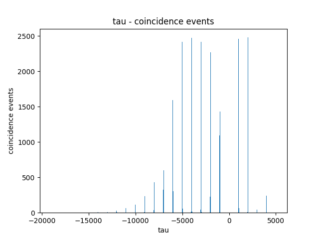
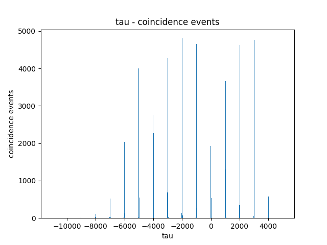
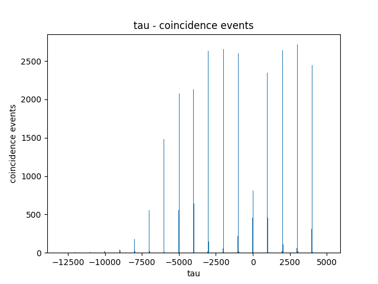
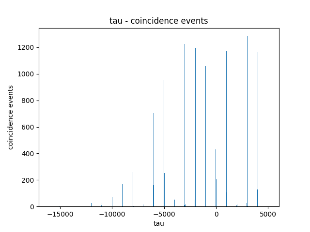

### one single photon emitter at 100% efficiency, 5ns lifetime, 1000ns time between pulse

### two single photon emitters, both at 100% efficiency, 5ns lifetime, 1000ns time between pulse

### one single photon emitter at 100% efficiency, another at 50% efficiency, both at 5ns lifetime, 1000ns time between pulse

### two single photon emitters, both at 50% efficiency, 5ns lifetime, 1000ns time between pulse

